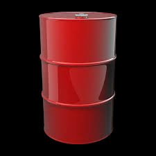
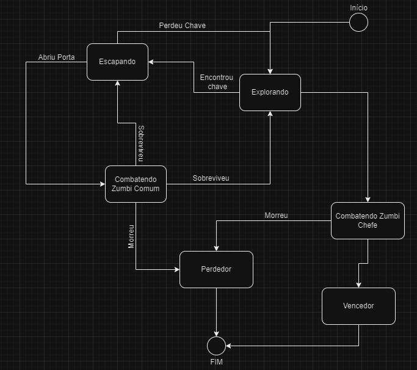

# **1. Barril**                                                                

Estado: bloqueado porém pode ser acionado pelo robô.                                                                    
Ações: Explodir. 

# **2. Robô** 

Estado: bloqueado, porém pode ser acionado se tirar 4 ou mais no dado.
 Ação: acionar helicóptero.

# **3. Helicóptero** 

Estado: bloqueado, porém pode ser acionado pelo robô. 
 Ação: dropar o barril. 

# **4. Porta** 
Estado: trancada,porém pode ser aberta com a chave. 
 Ação: bloquear passagem.

# **5. Chave** 

Estado: dropada. 
 Ação: abrir a porta. 

# **6. Cerca** 

Estado: bloqueando passagem. 
 Ação: bloquear caminho. 

# **7. Zumbi**  

Estado: parado até que seja atacado ou encontre o soldado. 
 Ação: causar dano (mordida).

# **8. Soldado** 

Estado: parado ou movimentando-se. 
 Ação: causar dano (tiros ou facadas), interação com objetos e portas.

# **Diagram Estado**

